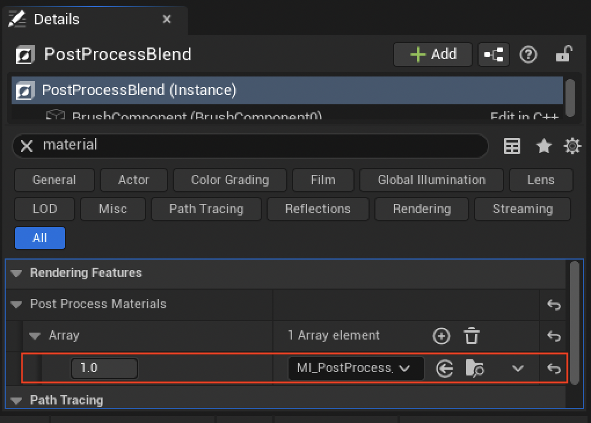
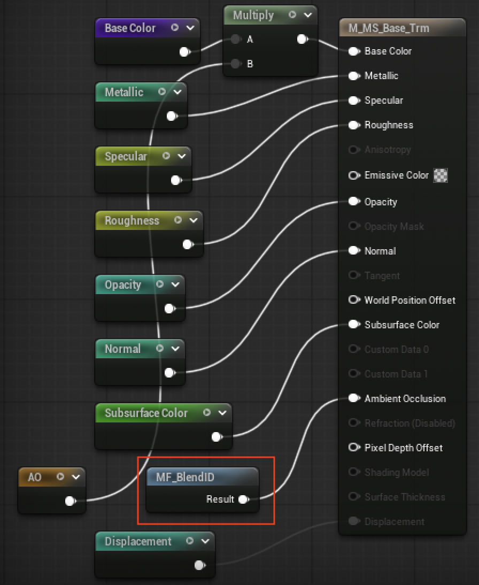
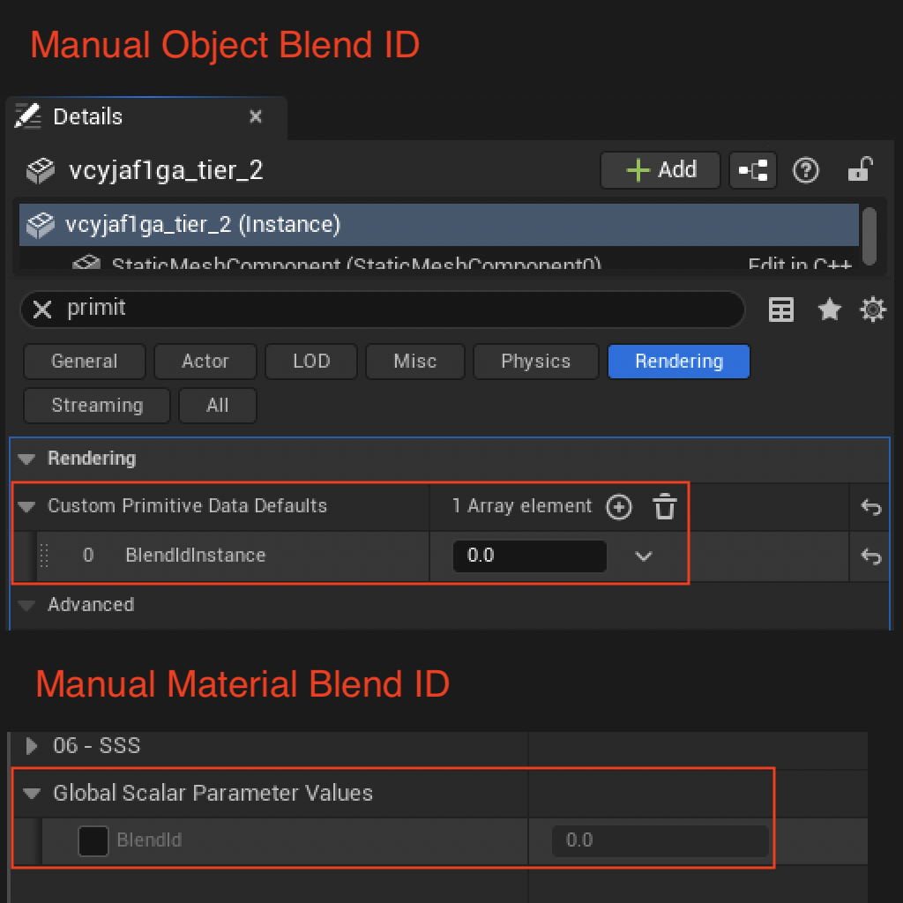

# AutoBlend – Easily blend objects in your scene

[Get it here](https://www.fab.com/listings/b474f704-c319-4fd0-87f3-651931da6b33){ .md-button .md-button--primary }

## Overview
AutoBlend blends meshes seamlessly into their surroundings using a post process pass and a small material graph change.  
It will automatically compute blend IDs for meshes, but you can override them per material or per object if needed.
  Unlike Runtime Virtual Texturing (RVT), Pixel Depth Offset (PDO), and other meshblend techniques, this effect works on any number of meshes at any position - not just where two surfaces meet.

- **Flexible placement**: Works anywhere in the scene, not only at terrain or surface-level intersections.
- **No extra prep**: No mesh vertex painting, RVT setup, or additional UVs/vertex data needed.
- **Scales well**: Adds very little overhead, so it works efficiently even with thousands of meshes.
- **No compile-time changes**: Drop it into existing materials without rebuilding shaders or the project.

<video autoplay loop muted playsinline preload="metadata" width="400">
  <source src="media/snow.mp4"  type="video/mp4">
  <source src="media/snow.webm" type="video/webm">
</video>

## Setup

=== "1. Installation"

    1. Click the AutoBlend button in the Unreal Editor toolbar to open the plugin window.
    2. Install the plugin by clicking the **Install** button.

=== "2. Add the post process effect"

    1. Add a *Post Process Volume* to your level.
    2. Add the `M_PostProcess_AutoBlend` material under **Rendering Features → Post Process Materials**.
    3. (Optional) Enable **Infinite Extent (Unbound)** to apply the effect everywhere.
    

=== "3. Hook up the Blend ID function"

    1. Open your mesh base material.
    2. Add the `MF_BlendID` material function node.
    3. Connect its output to **Ambient Occlusion** to enable blending.
    4. Repeat for all materials you want to blend.
    

    > Note: We can multiply `AO` with `Base Color` to include ambient occlusion in the final output.

-----

<video autoplay loop muted playsinline preload="metadata" width="400">
  <source src="media/forest.mp4"  type="video/mp4">
  <source src="media/forest.webm" type="video/webm">
</video>

## Usage
AutoBlend automatically computes a blend ID for every mesh with the material function applied.  
You can override this behavior:

- **Per Material Override**: Set the *Blend ID* scalar parameter in the material instance (affects all meshes using that material).
- **Per Object Override**: Set *Custom Primitive Data [0]* in the mesh instance settings for per-instance control.

<video autoplay loop muted playsinline preload="metadata" width="400">
  <source src="media/desert.mp4"  type="video/mp4">
  <source src="media/desert.webm" type="video/webm">
</video>
